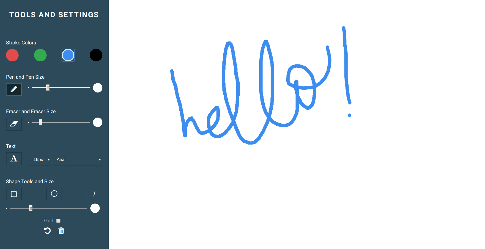

# Sketchpad App

This is a simple sketchpad/drawing web application built with HTML/CSS and Vanilla JavaScript. I learned a lot about manipulation the HTML canvas through this little project, and I'm pretty happy with the results!

# Screenshots
On Chrome v81.0.4044.92

# Features

- 4 Stroke colors
- Pen tool + stroke resizing
- Eraser tool + stroke resizing
- Text tool with three fonts and 4 font sizes
- Three shape tools + stroke resizing
  - Circle 
  - Rectangle
  - Line
- Grid
- Undo function
- Trash function (clear the canvas) 

# How to Use
On the left there is the toolbar with all the available tools and settings associated with each one. Just click whichever tool you want and start drawing away on the blank canvas on the right!

## Important Notes
- A selected tool will have a darker button color, non-selected tools will have a lighter button color.
- To add text, you have to press ENTER for it to stay on the canvas

# Credits 
This [YouTube video](https://youtu.be/XjJh0q2dBNo?t=2186) really helped with adding the shape tools and undo function as it introduced the concept of canvas ImageData to me and how to save the current canvas image.
